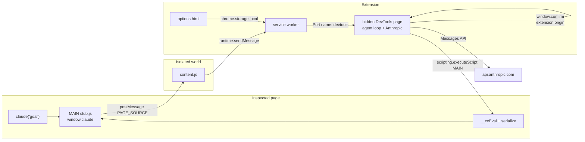
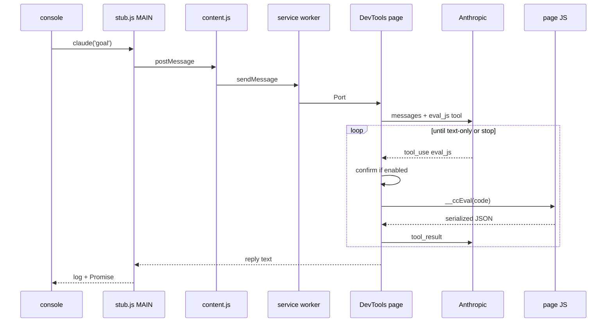

# Architecture

Console Claude is a Manifest V3 Chrome (and Edge) extension. The human types a goal in the page console. Claude inspects the live JavaScript runtime by calling `eval_js`. It is not a chatbot overlay.

## Runtime

A run only works while DevTools is open on that tab. The visible console is not enough. The hidden DevTools page owns the agent loop, the API key, and the confirm dialog. After you reload the extension, close DevTools and open it again.

## Why the loop is not in the service worker

MV3 service workers can sleep mid-run. The DevTools page stays alive for the whole console session. The worker only routes: config get/set, and tabId to the open DevTools port. The DevTools page reconnects and sends a 15s ping so a sleeping worker does not look like "DevTools is closed."

## Trust boundary

| Process | May see the API key | May run page JS |
| --- | --- | --- |
| Options page | yes (user pastes it) | no |
| DevTools page | yes (read from storage, fetch) | no, injects only |
| Service worker | settings object in storage calls | no |
| Isolated content script | no | no |
| MAIN stub | no | yes (`eval` of model code) |

Unit tests fail if `page-stub.ts` or `dist/stub.js` contain `apiKey`, `x-api-key`, `sk-ant`, `anthropic`, or `fetch(`.

Confirm uses `window.confirm` on the DevTools page, not the inspected page. The page can override its own `confirm`.

## Build

Four Vite passes. Always `npm run build`.

1. `vite.config.ts` empties `dist/` and builds options + DevTools HTML/JS
2. `vite.stub.config.ts` IIFE → `stub.js`
3. `vite.isolated.config.ts` IIFE → `content.js`
4. `vite.background.config.ts` IIFE → `background.js` (no ES module imports; Edge is picky)

## Source map

| Path | Role |
| --- | --- |
| `src/page-stub.ts` | MAIN world: `claude`, `__ccEval`, `__ccLog` |
| `src/content-isolated.ts` | Isolated bridge + confirm sync |
| `src/background.ts` | Ports, config, toolbar → Options |
| `src/devtools.ts` | Agent loop, Anthropic, confirm, eval |
| `src/agent.ts` | Step loop (no Chrome APIs) |
| `src/anthropic.ts` | `POST /v1/messages` |
| `src/eval-wrapper.ts` | Expression, then statement body |
| `src/serialize.ts` | Bounded JSON |
| `src/protocol.ts` | Message types |
| `src/settings.ts` | Models and defaults |
| `public/manifest.json` | MV3 |

## Invariants

- Do not put credentials or `fetch(` in `page-stub.ts`
- Do not steal `$`, `$$`, `$0`, or `copy`
- Confirm defaults on
- Serializer caps: depth 4, 100 keys, text 3000, html 10000
- `eval_js` is the only model tool unless you add routing in `agent.ts` and `devtools.ts` together
