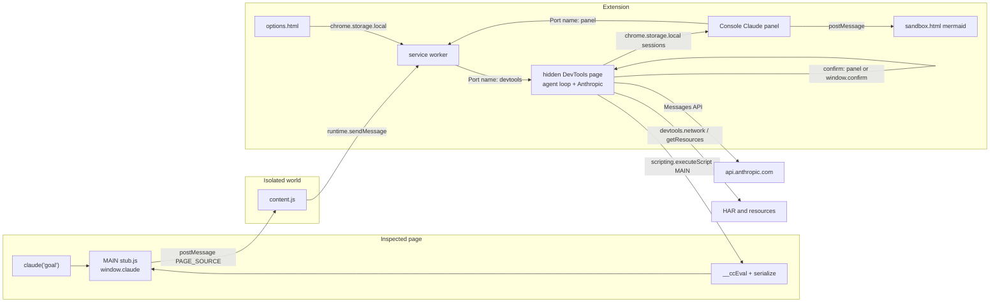
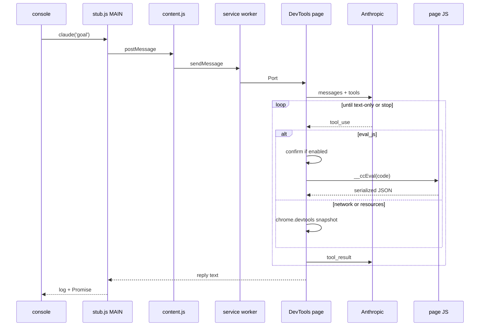

# Architecture

Console Claude is a Manifest V3 Chrome (and Edge) extension. The human types a goal in the page console. Claude inspects the live JavaScript runtime with `eval_js`, and can read Chrome-recorded traffic (`network`) and loaded URLs (`resources`). It is not a chatbot overlay.

## Runtime

A run only works while DevTools is open on that tab. The visible console is not enough. The hidden DevTools page owns the agent loop, the API key, and the confirm dialog. After you reload the extension, close DevTools and open it again.

## Why the loop is not in the service worker

MV3 service workers can sleep mid-run. The DevTools page stays alive for the whole console session. The worker only routes: config get/set, and tabId to the open DevTools port. The DevTools page reconnects and sends a 15s ping so a sleeping worker does not look like "DevTools is closed."

## Trust boundary

| Process | May see the API key | May run page JS |
| --- | --- | --- |
| Options page | yes (user pastes it) | no |
| DevTools page | yes (read from storage, fetch) | no, injects only |
| Service worker | settings object in storage calls | no |
| Isolated content script | no | no |
| MAIN stub | no | yes (`eval` of model code) |
| Mermaid sandbox page | no | no (diagram SVG only) |

Unit tests fail if `page-stub.ts` or `dist/stub.js` contain `apiKey`, `x-api-key`, `sk-ant`, `anthropic`, or `fetch(`.

When the Console Claude panel is connected, confirm is Allow / Deny in the panel. Otherwise it uses `window.confirm` on the DevTools page (extension origin), not the inspected page. The page can override its own `confirm`.

## Build

Five Vite passes. Always `npm run build`.

1. `vite.config.ts` empties `dist/` and builds options + DevTools + panel HTML/JS
2. `vite.stub.config.ts` IIFE → `stub.js`
3. `vite.isolated.config.ts` IIFE → `content.js`
4. `vite.background.config.ts` IIFE → `background.js` (no ES module imports; Edge is picky)
5. `vite.sandbox.config.ts` IIFE inlined into `sandbox.html` only (mermaid; unique-origin sandbox cannot fetch a sibling script)

## Source map

| Path | Role |
| --- | --- |
| `src/page-stub.ts` | MAIN world: `claude`, `__ccEval`, `__ccLog` |
| `src/content-isolated.ts` | Isolated bridge + confirm sync |
| `src/background.ts` | Ports, config, toolbar → Options |
| `src/devtools.ts` | Agent loop, Anthropic, confirm, eval, network, resources, session persist |
| `src/sessions.ts` | Origin-keyed session store |
| `src/panel.ts` | Console Claude panel view + composer |
| `src/markdown.ts` | GFM parse + DOMPurify for assistant turns |
| `src/sandbox.ts` | Bundled mermaid.render (MV3 sandbox page) |
| `src/panel-copy.ts` | Session delete mark (`×`) |
| `src/agent.ts` | Step loop (no Chrome APIs) |
| `src/observe.ts` | Pure HAR / resource summaries |
| `src/anthropic.ts` | `POST /v1/messages` |
| `src/eval-wrapper.ts` | Expression, then statement body |
| `src/serialize.ts` | Bounded JSON |
| `src/protocol.ts` | Message types |
| `src/settings.ts` | Models and defaults |
| `public/manifest.json` | MV3 |

## Invariants

- Do not put credentials or `fetch(` in `page-stub.ts`
- Do not steal `$`, `$$`, `$0`, or `copy`
- Confirm defaults on
- Serializer caps: depth 4, 100 keys, text 3000, html 10000
- Model tools: `eval_js` (page JS, confirm), `network` and `resources` (read-only `chrome.devtools.*`). Routing lives in `agent.ts` and `devtools.ts` together. No `chrome.debugger`.
- Each tool logs as one collapsed `Claude → name` group (input + result). Final text is `Claude:`.
- Assistant Markdown is `marked` then DOMPurify. User turns stay `textContent`. No images.
- Mermaid runs only in `sandbox.html`. Do not add `unsafe-eval` to `extension_pages` CSP.
